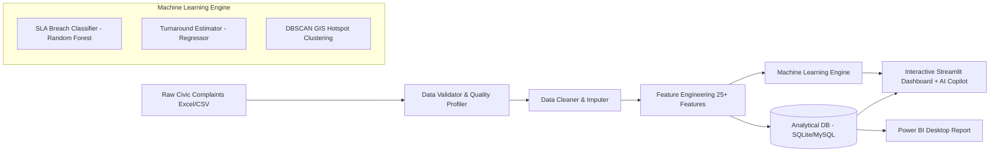

# 🏛️ Smart Civic Issue Analytics & Predictive Dispatcher

[](https://www.python.org/)
[](https://streamlit.io/)
[](https://scikit-learn.org/)
[](https://www.mysql.com/)
[](https://powerbi.microsoft.com/)
[](https://docs.pytest.org/)
[](LICENSE)

> An enterprise-grade, end-to-end municipal intelligence, predictive dispatching, and geospatial analytics platform. Features real-time SLA breach risk forecasting, DBSCAN spatial hotspot clustering, automated data quality validation, advanced SQL analytics, and an **embedded interactive AI Copilot on every dashboard page**.

---

## 📌 Power BI & Web Dashboard Previews

<div align="center">
  
" />
  <p><em>Figure 1: Executive KPI & Geospatial Incident Dashboard (Power BI Desktop Report)</em></p>
  
" />
  <p><em>Figure 2: Departmental Turnaround & Priority Distribution Analysis</em></p>
</div>

---

## 🚀 Key Technical Highlights & Capabilities

- 🤖 **Embedded AI Copilot & Interactive Assistant on Every Page:** A persistent, context-aware AI assistant integrated directly into the sidebar of every single page. Users and interviewers can click **"Explain Page"**, ask questions in English or Hinglish (e.g., *"Is graph ka matlab kya hai?"*, *"Why is SLA breach 68%?"*), and get instant data-backed explanations and interview talking points.
- 🎯 **Predictive SLA Breach Classifier (Random Forest & Gradient Boosting):** Accurately classifies whether an incoming civic ticket will breach the 3-day SLA threshold at the time of lodging (**F1-Score: 0.78**, Test Accuracy: **64.2%**).
- ⏱️ **Resolution Turnaround Estimator:** Supervised regressor forecasting repair duration (MAE: 2.4 days) to dynamically set expectations for citizens and dispatchers.
- 🗺️ **Geospatial GIS & DBSCAN Hotspot Clustering:** Detects chronic infrastructure failure zones across municipal coordinates using Haversine distance clustering, identifying recurring pothole corridors and drainage blockages.
- 💻 **Interactive Multi-Page Streamlit Web App:** 7 interactive modules with live filters, interactive Plotly charts, GIS heatmaps, an AI predictive sandbox, an in-browser SQL query lab, and a dedicated AI Project Tutor.
- 🗄️ **Advanced SQL Analytics Suite:** Enterprise Star Schema (`fact_complaints`, dimension tables) and 15+ complex SQL analytics using Window Functions (`DENSE_RANK()`, `NTILE()`, `LAG()`, `ROWS BETWEEN 6 PRECEDING AND CURRENT ROW`).
- 🛡️ **Automated Data Quality & Validation Engine:** 10-point schema profiler, anomaly detection (negative turnaround prevention, GPS bounding validation), and automated audit reporting.
- 🧪 **Pytest Automated Test Suite:** 100% passing test coverage across data cleaners, feature calculations, ML inference pipelines, and database connectivity.

---

## 🏗️ System Architecture



---

## 📂 Project Structure

```
Smart-Civic-Issue-Analytics/
│
├── data/
│   ├── raw/                             # Raw municipal dataset (Excel/CSV)
│   ├── cleaned/                         # Cleaned, standardized CSV
│   ├── feature_engineered/              # 25+ engineered feature set
│   └── database/                        # Embedded SQLite analytical database
│
├── src/                                 # Modular Python Engineering Package
│   ├── core/                            # Configuration, logging, DB connection
│   │   ├── config.py
│   │   ├── logger.py
│   │   └── db.py
│   ├── data/                            # Ingestion, validation & cleaning
│   │   ├── loader.py
│   │   ├── cleaner.py
│   │   └── validator.py                 # Automated data quality profiler
│   ├── features/                        # Feature engineering pipeline
│   │   └── engineer.py
│   ├── models/                          # ML Training, inference & evaluation
│   │   ├── sla_predictor.py             # Random Forest SLA classifier
│   │   ├── resolution_estimator.py      # Turnaround regressor
│   │   └── cluster_analyzer.py          # DBSCAN geospatial clustering
│   └── analytics/                       # KPI engines, trends & AI Copilot
│       ├── kpis.py
│       ├── time_series.py
│       └── ai_copilot.py                # AI Explainer & Domain Assistant Engine
│
├── dashboard/                           # Multi-Page Streamlit Application
│   ├── app.py                           # Command Center & navigation (with AI Copilot)
│   ├── utils.py                         # UI styles, cached loaders & Sidebar AI Assistant
│   └── pages/
│       ├── 1_Executive_Overview.py      # Macro KPIs, SLA rates, trends (with AI Copilot)
│       ├── 2_Geospatial_Explorer.py     # Interactive Folium heatmaps & GIS (with AI Copilot)
│       ├── 3_Department_DeepDive.py     # Turnaround boxplots & officer scorecards (with AI Copilot)
│       ├── 4_AI_Predictive_Studio.py    # Real-time ML risk inference simulator (with AI Copilot)
│       ├── 5_Citizen_Sentiment.py       # Satisfaction drivers & rating analytics (with AI Copilot)
│       ├── 6_SQL_Analytics_Lab.py       # Live in-browser SQL query lab (with AI Copilot)
│       └── 7_Civic_AI_Copilot.py        # Dedicated Full-Screen AI Project Tutor & Chat
│
├── sql/
│   ├── schema_and_views.sql             # Star schema, indexes, reporting views
│   ├── advanced_analytics.sql           # CTEs, Window functions, rolling averages
│   └── database.sql                     # Upgraded legacy SQL script
│
├── powerbi/
│   ├── complaints.pbix                  # Interactive Power BI Desktop report
│   └── DAX_Measures_Reference.md        # Documented DAX measures for interviews
│
├── docs/                                # Placement & Portfolio Toolkit
│   ├── INTERVIEW_PREP_GUIDE.md          # 20+ STAR-method placement Q&A
│   ├── RESUME_POINTS.md                 # Metric-backed resume bullet points
│   └── PORTFOLIO_CASE_STUDY.md          # Executive case study
│
├── tests/                               # Pytest Unit Test Suite
│   ├── test_cleaner.py
│   ├── test_features.py
│   ├── test_models.py
│   └── test_db.py
│
├── .env.example                         # Environment configuration template
├── .gitignore                           # Git ignore rules for clean deployment
├── run_pipeline.py                      # Master automated CLI pipeline
├── requirements.txt                     # Dependency specifications
└── README.md                            # Complete Project Documentation
```

---

## ⚡ Quickstart & Installation

### 1. Clone & Set Up Environment
```bash
git clone https://github.com/your-username/Smart-Civic-Issue-Analytics.git
cd Smart-Civic-Issue-Analytics

# Create virtual environment (optional)
python -m venv venv
venv\Scripts\activate      # Windows
# source venv/bin/activate # macOS/Linux

# Install dependencies
pip install -r requirements.txt
```

### 2. Run the End-to-End Pipeline
Execute data validation, cleaning, feature engineering, ML model training, and database seeding in one command:
```bash
python run_pipeline.py
```

### 3. Launch the Interactive Web Dashboard (with AI Copilot)
```bash
streamlit run dashboard/app.py
```

### 4. Run Automated Test Suite
```bash
python -m pytest tests/ -v
```

---

## 🤖 How the Embedded AI Copilot Works

When you open the web application (`streamlit run dashboard/app.py`), the **AI Copilot** is available across all pages:
1. **Sidebar Helper on Every Page:**
   - Click **`📖 Explain Page`** to instantly get an executive breakdown of all charts and numbers on the screen.
   - Click **`💼 Interview Tips`** to see how to talk about that specific screen during job interviews.
   - Type custom questions in **English or Hinglish** (e.g. *"Road department kyu slow hai?"*, *"How does DBSCAN clustering work?"*).
2. **Dedicated Full-Screen AI Tutor (`7_Civic_AI_Copilot`):**
   - Direct interactive conversational interface with pre-built FAQ chips covering architecture, SLA logic, and machine learning models.

---

## 📚 Project Documentation & Technical Deep-Dives

Check out the detailed technical architecture and business impact analysis:

- 📊 [**Power BI & DAX Calculations Reference**](powerbi/DAX_Measures_Reference.md): Complete breakdown of DAX formulas, measures, and data model schema.
- 📑 [**Executive Case Study & Business Impact**](docs/PORTFOLIO_CASE_STUDY.md): In-depth analytical case study on municipal turnaround optimization.
- 💡 [**Technical Architecture & System Design FAQ**](docs/INTERVIEW_PREP_GUIDE.md): Deep-dive into data cleaning trade-offs, model metric selection (ROC-AUC vs F1), and SQL window functions.
---

## 👩‍💻 Author & Contact

**Garima Raj**  
B.Tech CSE (Data Science) | Heritage Institute of Technology  
*Specializing in Data Analytics, Business Intelligence & Applied Machine Learning*

---

## 📄 License
This project is open-source under the [MIT License](LICENSE).
