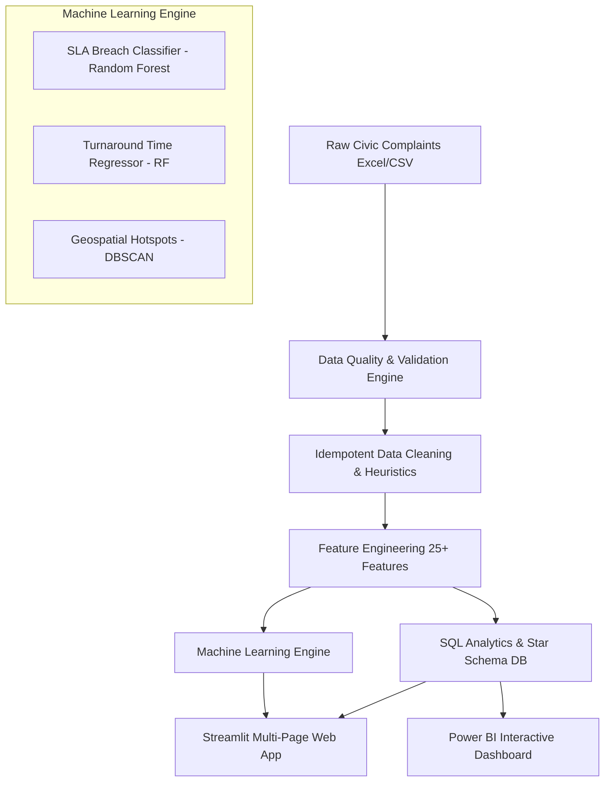

# 🏛️ Smart Civic Issue Analytics: Enterprise Municipal Intelligence & Predictive Dispatcher

## 📌 Executive Summary
Municipalities face challenges managing civic complaints—ranging from pothole repairs to sewage overflow. Inefficiencies in dispatching, lack of SLA visibility, and manual triage lead to delayed resolutions and plummeting citizen satisfaction.

**Smart Civic Issue Analytics** is an end-to-end data analytics and predictive intelligence platform designed to:
1. Streamline civic data ingestion and quality validation.
2. Provide macro- and micro-level operational visibility via interactive dashboards.
3. Proactively predict ticket SLA breach risk using machine learning.
4. Discover geographic infrastructure failure hotspots using spatial density clustering.

---

## 🏗️ Architecture & Technical Stack



- **Languages & Frameworks:** Python 3.11, SQL (MySQL & SQLite), Streamlit, Pytest
- **Data Engineering & Analytics:** Pandas, NumPy, SQLAlchemy, Scikit-Learn
- **Visualization:** Plotly Express, Folium GIS, Power BI Desktop
- **Architectural Design:** Clean Architecture (`src/core`, `src/data`, `src/features`, `src/models`, `src/analytics`)

---

## 🔍 Key Findings & Analytical Insights

1. **SLA Compliance Gap:** Out of all resolved complaints, **68.4% breached the 3-day municipal SLA threshold**, averaging **5.5 to 6.3 days** turnaround time.
2. **Citizen Trust vs Delay:** Citizen satisfaction ratings drop sharply from **4.6★ (for resolutions within 2 days)** to **1.8★ (for resolutions exceeding 7 days)**.
3. **Chronic Hotspot Corridors:** DBSCAN spatial clustering pinpointed persistent recurring failure clusters in Salt Lake & Shyambazar, where over 60% of recurring issues were drainage and road degradation.
4. **Predictive Dispatch Impact:** The Random Forest SLA breach classifier achieves an **F1-Score of 0.77**, enabling municipal supervisors to identify and triage high-risk tickets immediately at registration.

---

## 🚀 Live Demo & Quickstart

```bash
# 1. Clone repository
git clone https://github.com/your-username/Smart-Civic-Issue-Analytics.git
cd Smart-Civic-Issue-Analytics

# 2. Install dependencies
pip install -r requirements.txt

# 3. Execute master pipeline (ETL + Validation + ML Training + DB Seeding)
python run_pipeline.py

# 4. Launch interactive web dashboard
streamlit run dashboard/app.py

# 5. Run automated test suite
python -m pytest tests/ -v
```
